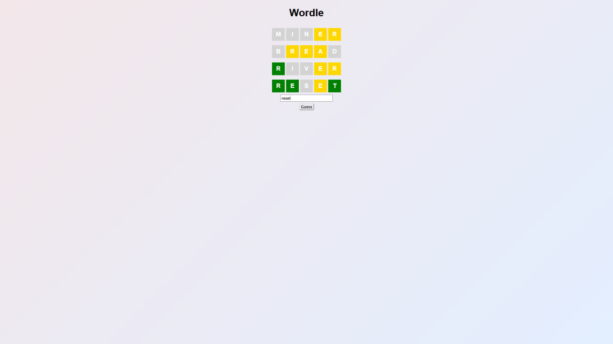

## 🟩 Wordle Clone (React)
A simple Wordle clone built with React.
Try to guess the hidden 5-letter word (REACT) in 6 attempts or less!

## 🔧 Features
Built using functional React components with useState

Real-time input handling and validation

Displays color-coded results for each guess via the Row component

Game over logic after a correct guess or 6 failed attempts

## 🚀 Technologies Used
React (JSX)

CSS Modules (basic styling in App.css)

JavaScript (ES6+)

## 📸 Screenshots


## 📁 Project Structure
<pre>
./
├── App.jsx
├── App.css
├── Row.jsx
├── Row.css
├── index.html
├── index.jsx
├── screenshots/
│ ├── home-page.jpg
│ ├── pokedex-demo.jpg
│ └── search-functionality.jpg
└── README.md
</pre>

## 📦 Installation & Run
```bash
npm install
npm start
